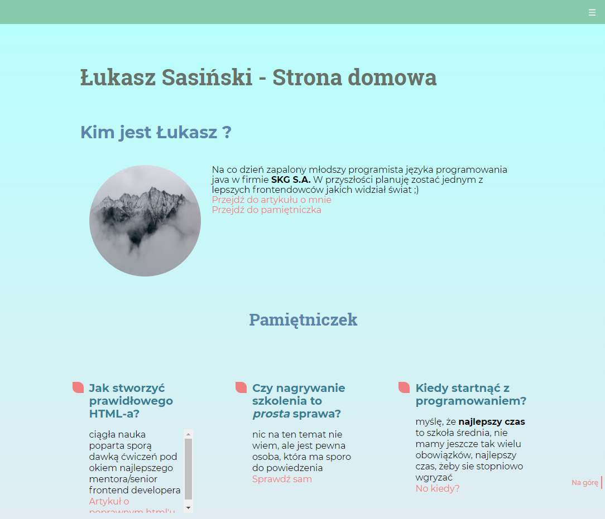
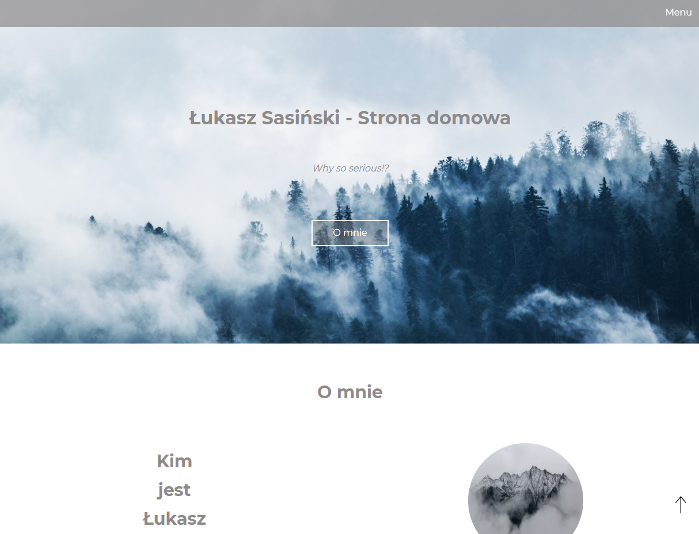
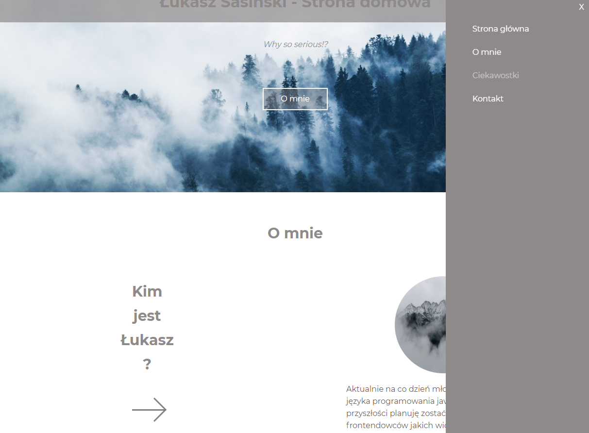

# Moja strona domowa

Zapraszam, zobacz na żywo: [Łukasz homepage](https://sasinskil.github.io/homepage-gulp)

## Co zrobić aby uruchomić stronę lokalnie ?

`npm install -g gulp-cli`

`npm install`

`gulp`

Aby ***opublikować*** stronę za pomocą github pages użyj `npm run deploy`

### Demo nadchodzącej nowej wersji...

Rozwinięte menu...

